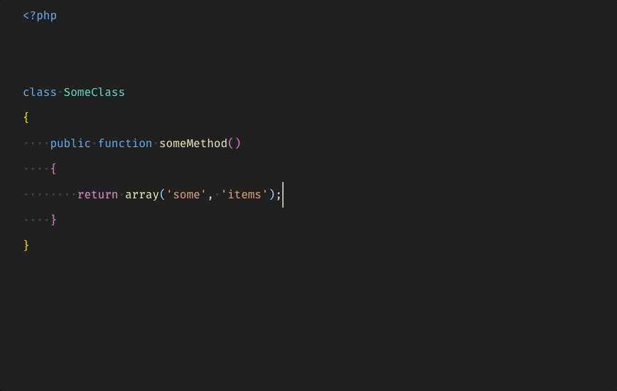

# Simple PHP CS Fixer README

A simple extension for using php-cs-fixer in VS Code.

If no .php_cs.dist file (or other configuration) is found, it will use the default configuration for the Laravel project: https://gist.github.com/laravel-shift/cab527923ed2a109dda047b97d53c200

---

## The Command:
`simple-php-cs-fixer.fix`

---

## Config:

Look for a custom project specific config file?

`"simple-php-cs-fixer.useConfig": true`

The path to that config file. (relative to the project root)

`"simple-php-cs-fixer.config": ".php_cs.dist"`

Run the fixer on save?

`"simple-php-cs-fixer.save": false`

Whether php-cs-fixer should be using a cache

`"simple-php-cs-fixer.usingCache": false`

A comma separated list of rules to be used by php-cs-fixer

`"simple-php-cs-fixer.rules": "@PSR1,@PSR2,trailing_comma_in_multiline_array"`

---

\- Enjoy!
